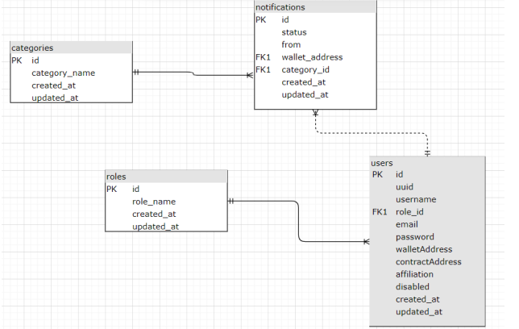

# Consenter CMS Database Manager
This is part of a larger Blockchain research project whose aim was to come up with a Blockchain solution that allows data subjects fine grained control over the data processors/controllers that have access to their information. This repository can be found [here](https://github.com/nkanyi73/Consenter-Consent-Management-System).

## How it works
This is a Database Manager that connects to a MySQL Database for the Consenter: Consent Management System (link is above). This is an API, that makes use of the Sequelize package as an Object Relational Mapper (ORM). An ORM was used in order to eliminate the need to write complex queries. The API has several end points as required by the main application. The database consists of four tables
* Users Table - holds information about all users in the system
* Roles Table - holds information about all available roles
* Categories Table - holds information about all categories of information available (refer to main project)
* Notifications Table - holds information about all notifications for all users in the system



## Project Setup
To run this, you need npm package manager. Information on how to install npm for your respective OS can be found [here](https://docs.npmjs.com/downloading-and-installing-node-js-and-npm)

Next, you have to install the packages that the project depends on by running
```
npm install
```
After all the packages have been installed run
```
nodemon app.js
```
This will start the development server. 

### Points to Note
#### Creating the Database
The database needs to first be created to use this server. To do this run the command (while on the parent directory),
```
node_modules/.bin/sequelize db:create
```
#### Migrations
Next, run the migrations to create the tables and relationships. Use the command,
```
node_modules/.bin/sequelize db:create
```
#### Seeders
Next, run the seeders. Use the command
```
node_modules/.bin/sequelize db:seed:all
```
## Found a Bug?
If you found an issue or would like to submit an improvement to this project, please submit an issue using the issues tab above. If you would like to submit a PR with a fix, reference the issue you created!